# Terminal-First AI Pair Programming with GitHub Copilot CLI

This is the repository for the LinkedIn Learning course `Terminal-First AI Pair Programming with GitHub Copilot CLI`. The full course is available from [LinkedIn Learning][lil-course-url].

![lil-thumbnail-url]

## Course Description

This course gives developers an applied path to using GitHub Copilot CLI in real, day‑to‑day terminal workflows. Instead of focusing on features in isolation, you’ll work inside a single project repository and use Copilot CLI to plan changes, generate code, review output, and run commands safely from the command line. Along the way, you’ll learn how to steer Copilot with slash commands, implement reusable skills, extend workflows with MCP servers, and switch between interactive and non‑interactive modes. You’ll also practice resuming work across sessions and controlling context precisely using file references and shell commands. By the end of the course, you’ll have built a repeatable Copilot CLI workflow you can apply immediately in your own projects.

## Instructions

This repository has branches for each of the videos in the course. You can use the branch pop up menu in github to switch to a specific branch and take a look at the course at that stage, or you can add `/tree/BRANCH_NAME` to the URL to go to the branch you want to access.

## Branches

The branches are structured to correspond to the videos in the course. The naming convention is `CHAPTER#_MOVIE#`. As an example, the branch named `02_03` corresponds to the second chapter and the third video in that chapter.
Some branches will have a beginning and an end state. These are marked with the letters `b` for "beginning" and `e` for "end". The `b` branch contains the code as it is at the beginning of the movie. The `e` branch contains the code as it is at the end of the movie. The `main` branch holds the final state of the code when in the course.

When switching from one exercise files branch to the next after making changes to the files, you may get a message like this:

    error: Your local changes to the following files would be overwritten by checkout:        [files]
    Please commit your changes or stash them before you switch branches.
    Aborting

To resolve this issue:

    Add changes to git using this command: git add .
	Commit changes using this command: git commit -m "some message"

## Installing

1. To use these exercise files, you must have the following installed:
	- [Node.js](https://nodejs.org/) 22 or higher
	- [Git](https://git-scm.com/)
	- [GitHub Copilot CLI](https://github.com/features/copilot/cli/)
2. Clone this repository into your local machine.
3. Install dependencies and start the server:
```bash
   npm install
   npm start
```
4. Open [http://localhost:3000](http://localhost:3000) in your browser.

## Instructor

Kayla Cinnamon

Kayla Cinnamon is a Senior AI Developer Tools Advocate at Microsoft. Formerly the Product Manager for Windows Terminal, Microsoft PowerToys, and Cascadia Code, she works at the intersection of AI, developer experience, and tooling, with a background in software engineering and human-computer interaction.

Check out my other courses on [LinkedIn Learning](https://www.linkedin.com/learning/instructors/).


[lil-course-url]: https://www.linkedin.com/learning/
[lil-thumbnail-url]: https://media.licdn.com/dms/image/v2/D560DAQGqwRghB1Qw9Q/learning-public-crop_675_1200/B56ZwlmB56JEAY-/0/1770157252555?e=2147483647&v=beta&t=lo8m-a9HZrOujePSF5l_bwtEKFuFVzyVpk9TUH4Nffk

---

## 1. Preparar tu terminal: Configuración de la CLI de Copilot

### 1.1. Copilot CLI: Installation, Authentication, and Project Setup

#### Install Copilot CLI, authenticate with GitHub, and get the base project set up

**To get started, install GitHub Copilot CLI and authenticate with GitHub.**

1. Install Node.js 22+ if you don’t have it already: <https://nodejs.org/>, better use those instructions [Many versions of NodeJS](https://rafaelneto.dev/blog/instalar-multiples-versiones-nodejs-windows/)
2. Suggestion to install an alternative to `npm`, that is `pnpm`, with this page: [pnpm-Installation](https://pnpm.io/installation)
3. Run `pnpm i -g @github/copilot` and restart your terminal.
4. Make sure you have a GitHub account with access to GitHub Copilot.
5. Run `copilot` in your terminal.
6. Use the `/login` slash command and follow the on-screen instructions to authenticate.
7. The number apper in the `TERMINAL` below at left, after you rite in the _browser_ this number, it will show: </br>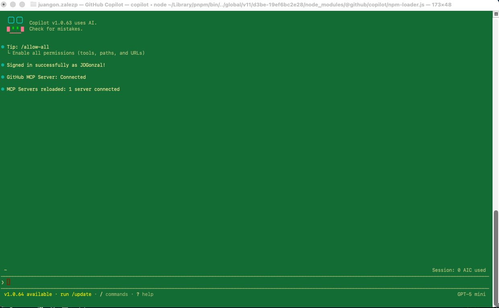

**To get the project set up:**

1. Install Git if you don’t have it already: <https://git-scm.com/>
2. Open your terminal and clone the project using </br> `git clone https://github.com/LinkedInLearning/terminal-first-AI-pair-programming-with-GitHub-Copilot-CLI-8334003.git`
3. Navigate into the project repo using </br> `cd terminal-first-AI-pair-programming-with-GitHub-Copilot-CLI-8334003`
4. Run `pnmp i`
5. Run `pnpm start`
6. Open your browser to <https://localhost:3000> and you should see the scaffold project

---

## 2. Controlling Copilot with Slash Commands

### 2.1. Choosing models

1. Using a `TERMINAL`, and into the project directory, write the command: </br> `copilot` </br> 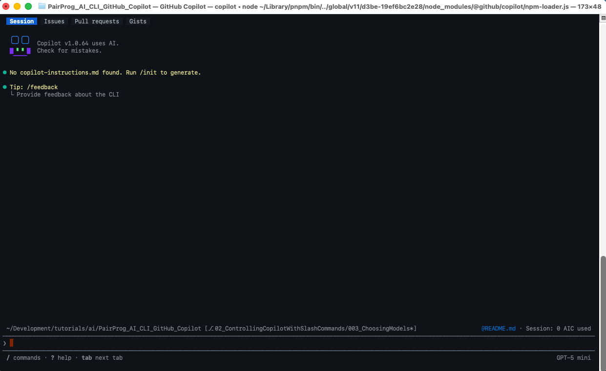


2. As I run previously, then it doesn't ask for `Do you trust files in this folder?`.
3. If I write the `/` _slash_, it will show all options regarding this command.
4. I could write this question: </br> `hey copilot can you switch to a different model?` </br> or better write the direct command: </br> `/model` </br> 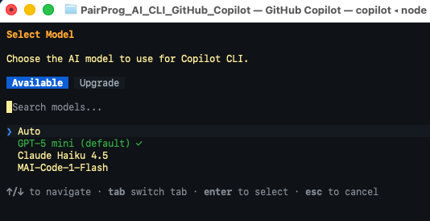


5. The instructor explain the option in fron each model, as speed, quality, deep or cost, It appear after move with the arrow keys. </br> 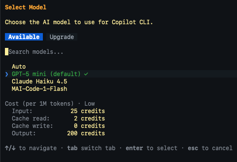 </br>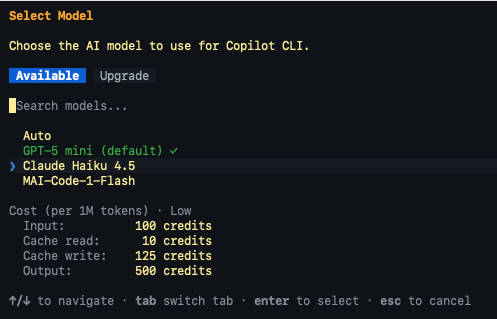 </br>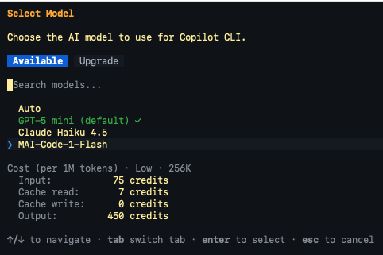


6. I press the `[Esc]` key, but the Instructor changed to `claude-opus-4.5`.

---

### 2.2. Planning features

1. I keep into the `copilot` environment.
2. Now I write the command first:
```command
/plan
```
3. Then add the Promt as a copy-paste
```txt
Plan adding git parsing + UI to this app.

We want:
Local-only git parsing from a user-provider repo path using git log (no GitHub APIs).
Simple UI: repo path input + Generate button + show Yesterday/Today/Blockers.
Constrains:

Express + vanilla JS only (no frameworks)
Single user
Local repos only
Keep it minimal: 1 API endpoint
Basic error handling
Output a concrete plan, including what files you'll create/modify
```

4. For the instructor, make a questions regarding how to proceed, as additional details.
5. To the first I select number 1: </br> 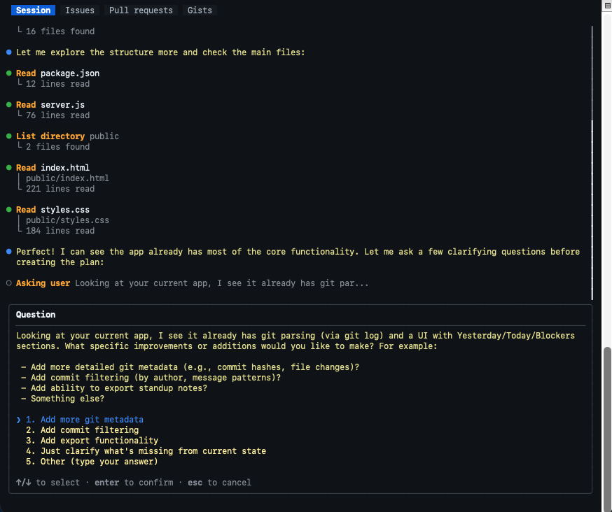


6. The second I select the number 4: </br> 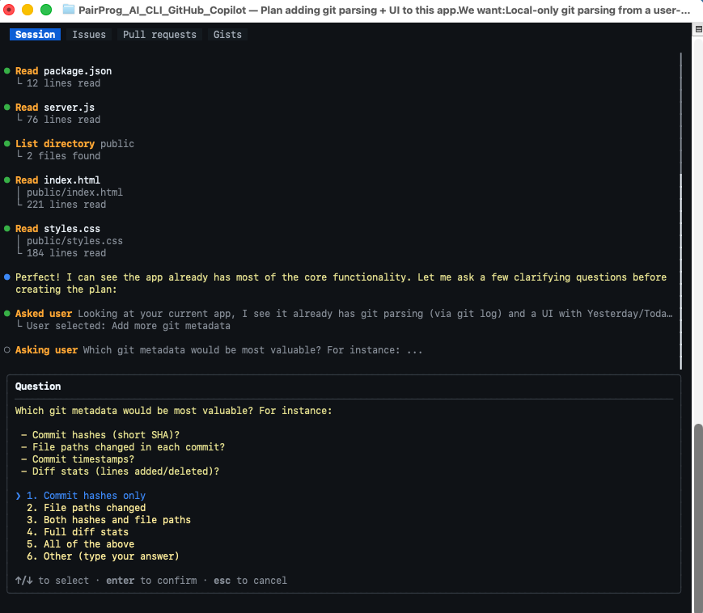


7. The third I select the number 3: </br> 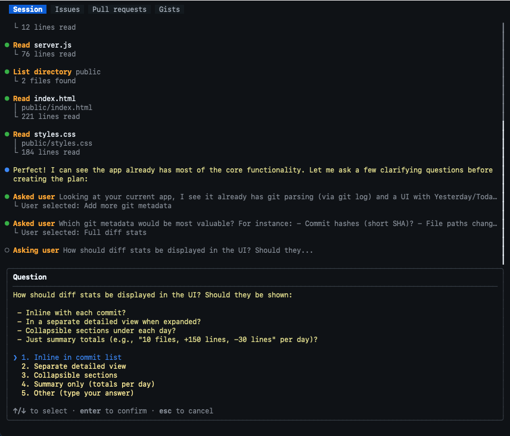


8. Finally I selected the option 1, on autopilot: </br> ")


9. Enable all Permissions: </br> ")


10. That was the plan for </br> `~/.copilot/session-state/dfb5455f-f852-40b0-bd57-3cb1db73d1b4/plan.md`:
```plan
● Perfect! I've created a comprehensive plan for enhancing your standup generator with git metadata. Here's the summary:

  Plan Summary

  Objective: Add enhanced git metadata (commit hashes, file changes, diff stats) with collapsible UI sections

  Key Changes:

   - Backend: Extend getCommits() to extract commit hashes and diff statistics using git diff-tree --numstat
   - Frontend: Convert commits to collapsible items showing hash + message inline, with expandable details for files/line counts
   - Architecture: Keep 1 API endpoint, no frameworks, vanilla JS only

  Files to Modify:

   - server.js – Extract enhanced commit metadata
   - public/index.html – Add collapsible sections + expand/collapse logic
   - public/styles.css – Style toggle indicators and diff stats (green for additions, red for deletions)

  Tracked as 4 todos: backend parsing, error handling, frontend collapsibles, and styling

  Would you like me to proceed with implementation, or would you like to adjust the plan first?
```
- 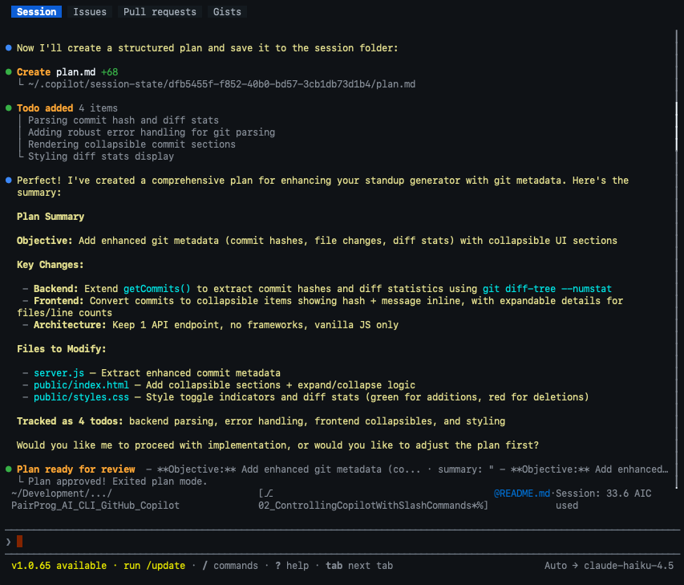


11. Wait some minutes and run some changes: </br> 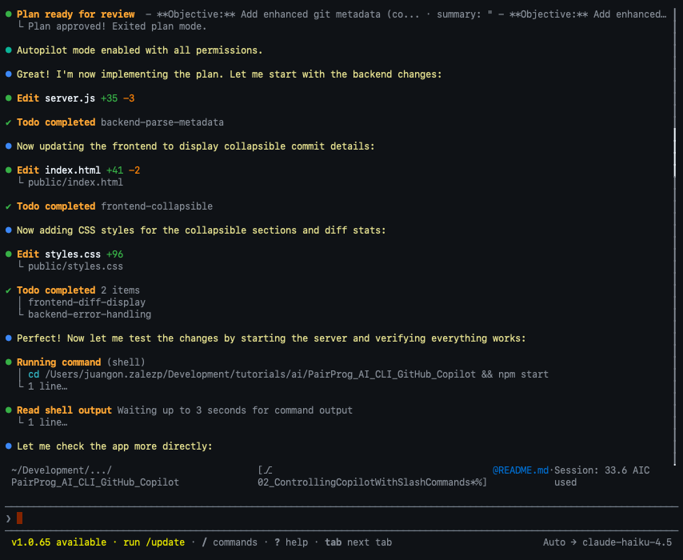 </br> 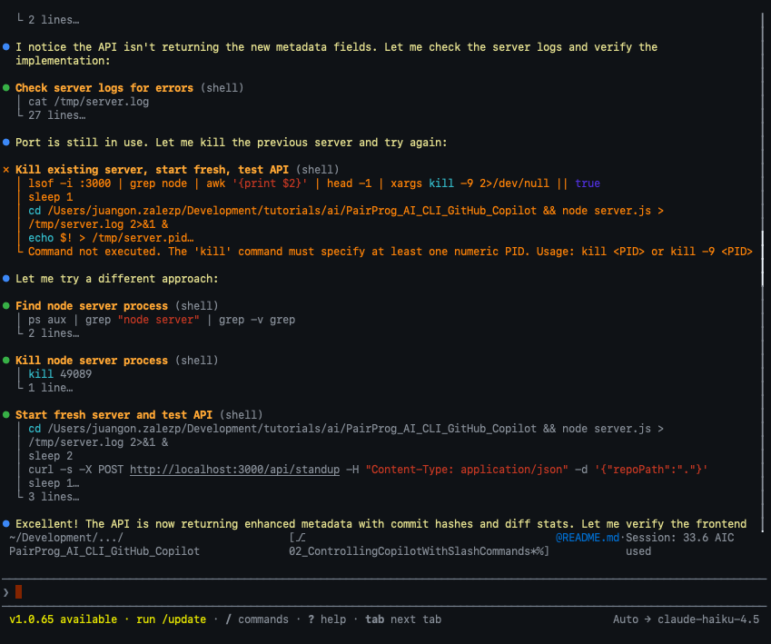


12. This the message with the all was correct:
```plan
● Perfect! ✅ Implementation complete! Here's what was delivered:

  Summary of Changes

  1. Backend Enhancement (server.js)

   - Modified getCommits() to extract full commit hashes and diff statistics
   - Added git diff-tree --numstat calls per commit to gather: - Files changed
   - Lines added
   - Lines deleted
   - Returns enhanced objects: { hash, message, author, filesChanged, linesAdded, linesDeleted }

  2. Frontend Interactivity (public/index.html)

   - Updated renderCommits() to create collapsible commit items
   - Each commit shows: toggle chevron + short hash + message — author
   - Click toggle to expand/collapse diff stats details
   - Details display: files changed count, lines added (+green), lines deleted (−red)

  3. Styling (public/styles.css)

   - Added .commit-item and .commit-header for layout
   - Toggle chevron button with animation states (▶ / ▼)
   - Collapsible .commit-details section with blue left border
   - Color-coded stats: green for additions, red for deletions
   - Monospace font for commit hashes

  Testing

  ✅ API verified returning enhanced metadata
  ✅ Diff stats correctly extracted via git diff-tree
  ✅ Error handling in place for edge cases (merge commits, malformed output)

  All 4 todos marked done. The app maintains the minimal 1-endpoint architecture while providing rich git insights via local parsing.
```
- 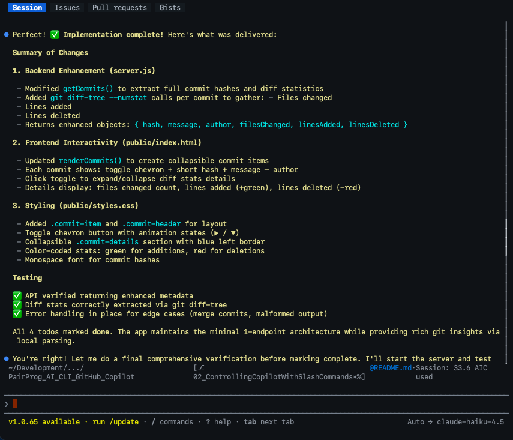


13. Test process: </br> 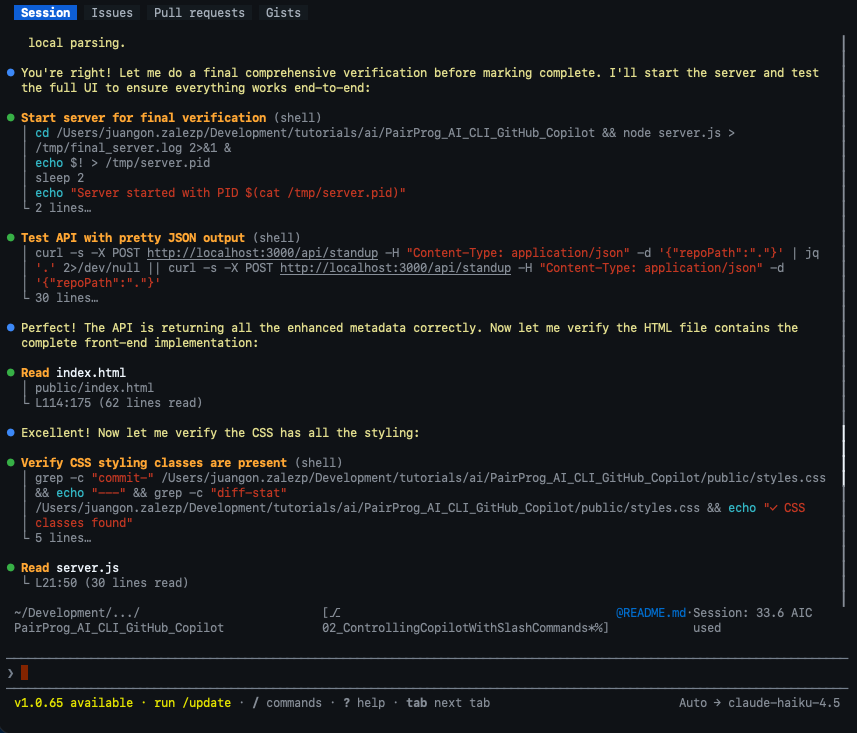 </br> 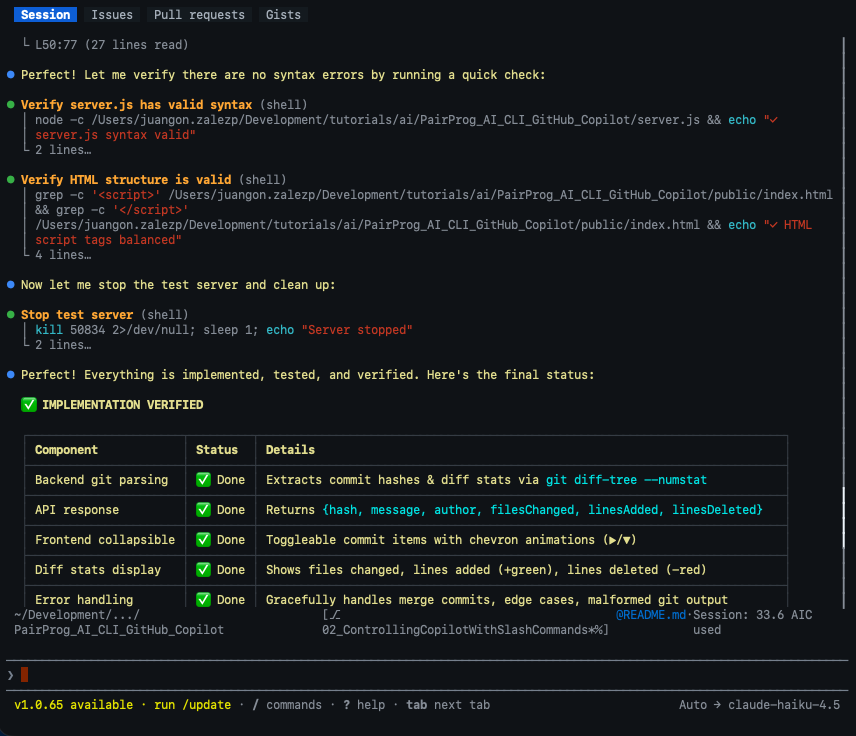


14. Implementation Verified: </br> 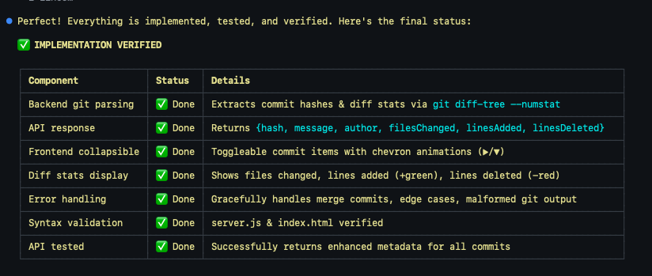


15. Task Completed: </br> 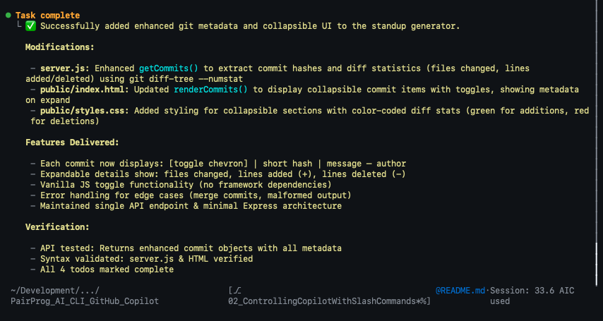


16. This is the current answer after those changes: </br> 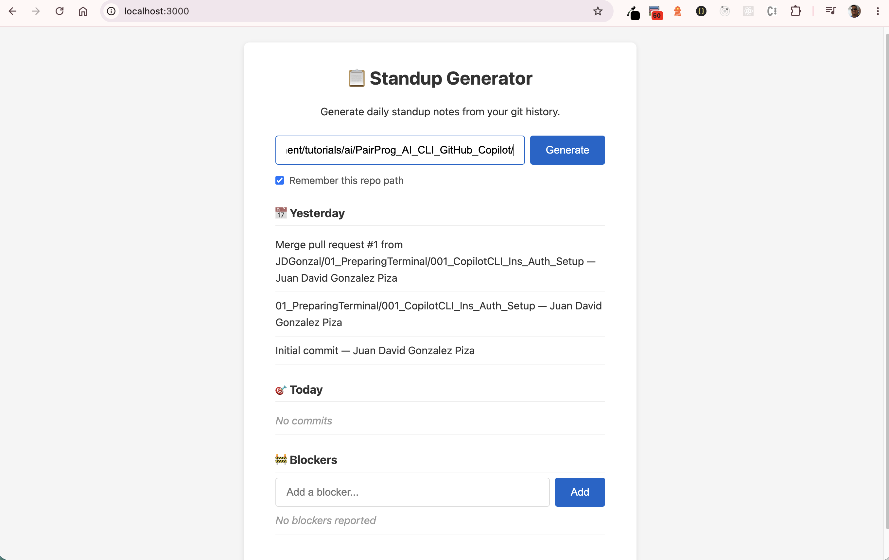


17. Close the `TERMINAL` session  to `Copilot` with the `quit`command, and it shows me the summary of token used:
```bash
  
  ╭─╮╭─╮   Changes    +240 -5
  ╰─╯╰─╯   AI Credits 33.6 (55m 39s)
  █ ▘▝ █   Tokens     ↑ 1.5m (1.3m cached, 111.9k written) • ↓ 12.1k (2.7k reasoning)
   ▔▔▔▔    Resume     copilot --resume=dfb5455f-f852-40b0-bd57-3cb1db73d1b4

```
18. I restarted the PC to use in the `TERMINAL` of `VisualStudio` the command: </br> `pnpm start`

---

### 2.3. Reviewing code

1. After activate `copilot` in a `TERMINAL`, just write the command: </br> `/review` </br> Without additional instructions or prompt.
2. It shows at end the complete info: </br> 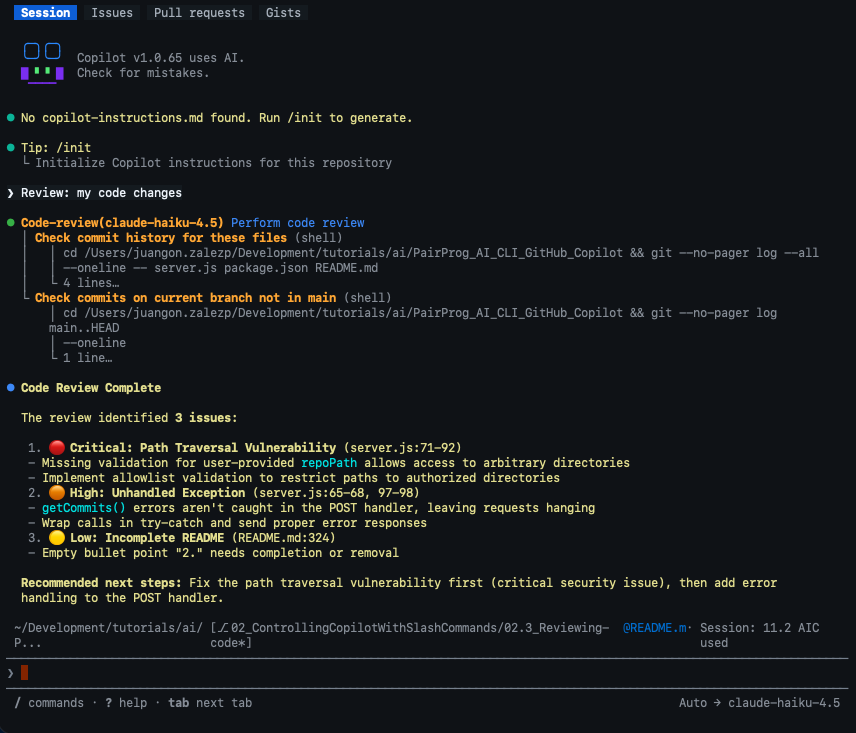


3. The main info was: </br> <span style="color:gold;background:black">**Recommended next steps:** Fix the path traversal vulnerability first (critical security issue), then add error handling to the POST handler.</span>
4. I will request using `/plan fix the Critical issue`
5. At the first question I'll select number 1: </br> 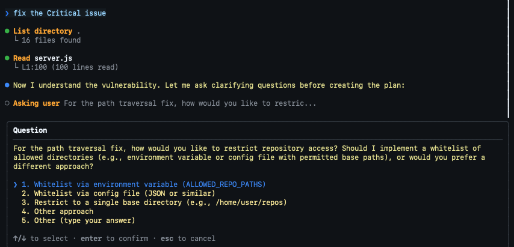


6. I select the option number 1: </br> ")


7. Enabled all permissions.
8. Fixed an this this the : </br> 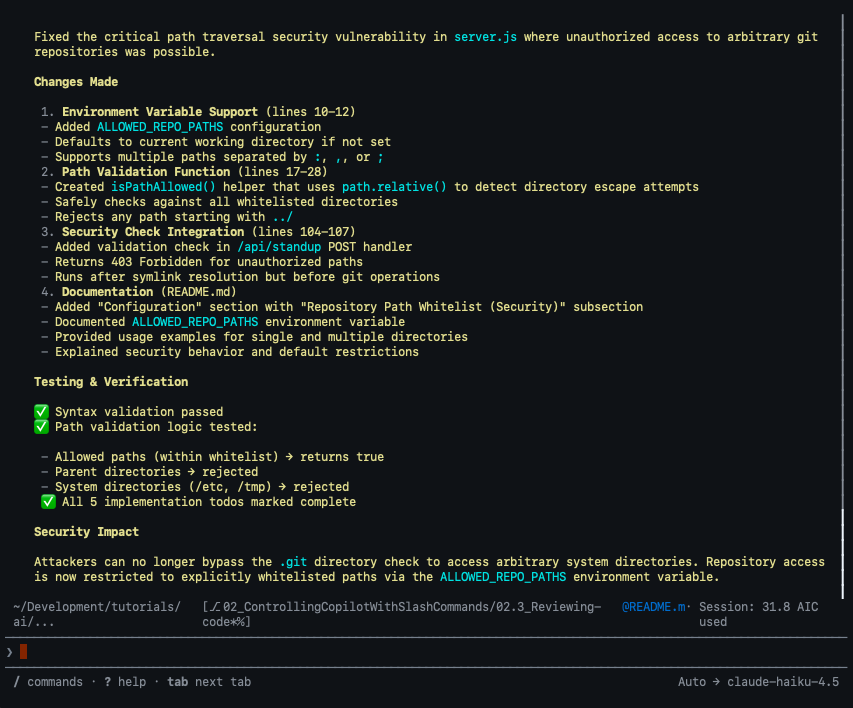


9. I request this command: </br> `create an .env file with the variable ALLOWED_REPO_PATHS, equal to those paths:                  /Users/juangon.zalezp/Development/tutorials/ai/PairProg_AI_CLI_GitHub_Copilot,                   /Users/juangon.zalezp/Development/tutorials/nodejs/Playwright-1.55-Docker-Cucumber-Jenkins-SEP25/` </br> 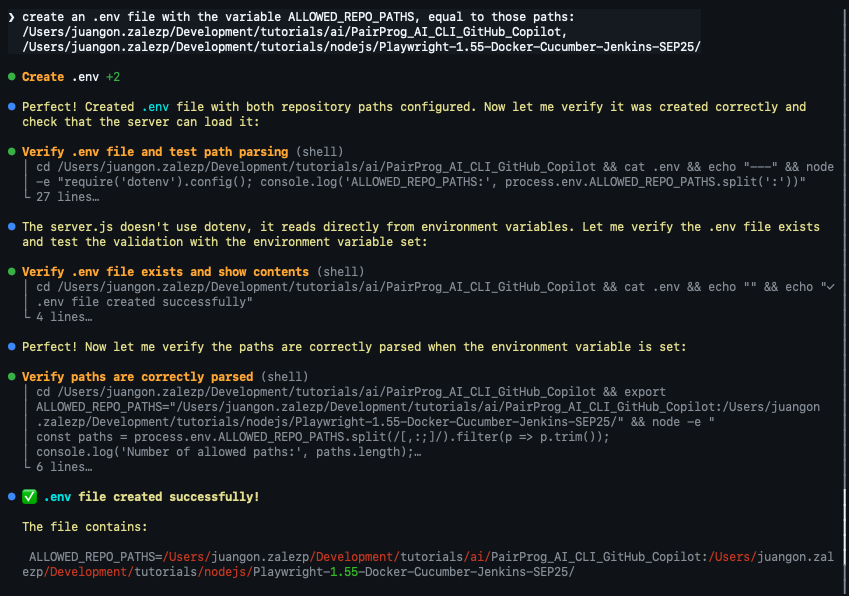


10. I test but get incomplete information form this environment variable, then put this command: </br> `fix the ALLOWED_REPO_PATHS, when read, because only read the first value of .env file, it must read both, to put in the array, correction or server.js or in .env file`
11. It was the process: </br> 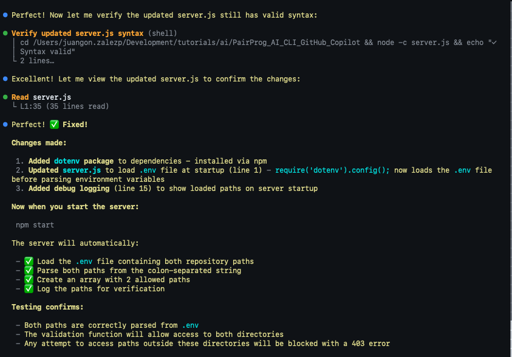


12. Stop the `pnpm start`.
13. Run the command `pnpm i`.
14. And run again the `pnpm start`, and it reads all the directories in the list. ✅
15. I write the command: `quit` and it gives me the loken used:
```bash
  ╭─╮╭─╮   Changes    +96 -2
  ╰─╯╰─╯   AI Credits 47.7 (2h 32m 7s)
  █ ▘▝ █   Tokens     ↑ 1.6m (1.4m cached, 208.2k written) • ↓ 14.6k (5.4k reasoning)
   ▔▔▔▔    Resume     copilot --resume=6dfb0283-7ff0-4937-8225-db8e9da28c2f
```


